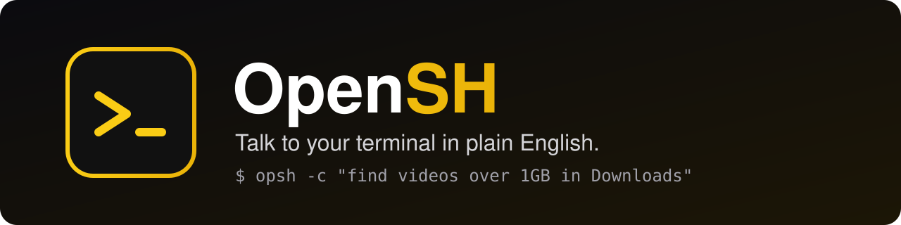
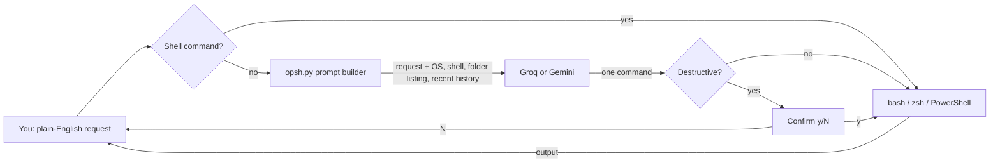

<div align="center">



[](https://github.com/muhib-karim/OpenSH/actions/workflows/ci.yml)
[](https://github.com/muhib-karim/OpenSH/releases/latest)
[](https://opensh.vercel.app)
[](LICENSE)
[](https://www.python.org)
[](https://ko-fi.com/ai_dev_2024)

**[Install](#-install)** · **[Usage](#-usage)** · **[Safety](#%EF%B8%8F-safety)** · **[Configuration](#%EF%B8%8F-configuration)** · **[Architecture](#-architecture)** · **[Development](#-development)**

</div>

## What it is

**OpenSH** turns your terminal into a natural-language shell. Type what you want; OpenSH works out the right command for your OS and shell (PowerShell on Windows, Bash/Zsh on macOS and Linux), shows it, and runs it.

```text
~/projects/app > find all video files over 1GB in my downloads folder
→ find ~/Downloads -type f \( -name "*.mp4" -o -name "*.mov" -o -name "*.mkv" \) -size +1G
```

Plain shell commands (`ls`, `git status`, `docker ps`, …) pass straight through, so it works as your everyday shell too.

## ✨ Features

| | |
| :--- | :--- |
| 🗣️ **Plain English** | Describe the task; get the exact command for your platform. |
| ⚡ **Auto-run** | Safe commands run immediately; no extra keypress. |
| 🛡️ **Safety guard** | Commands that delete data, wipe disks, rewrite git history or shut the machine down always ask first. |
| 🧠 **Context-aware** | Sees the files in the current folder and your recent commands, so "open the resume folder" finds `Current Resume`. |
| 🔁 **Cross-platform** | Windows (PowerShell), macOS and Linux (Bash/Zsh). |
| 🔌 **Two providers** | Groq (Llama 3.3 70B, free tier) or Google Gemini 2.0 Flash, your own key. |
| 📦 **Standalone builds** | Each release ships single-file binaries for Windows, macOS and Linux. |

## 📦 Install

**Windows (PowerShell)**
```powershell
irm https://raw.githubusercontent.com/muhib-karim/OpenSH/main/install.ps1 | iex
```

**macOS / Linux**
```bash
curl -fsSL https://raw.githubusercontent.com/muhib-karim/OpenSH/main/install.sh | bash
```

The installer puts OpenSH in `~/.opsh/` and adds the `opsh` command to your PATH. Prefer a binary? Download `opsh` for your platform from the [latest release](https://github.com/muhib-karim/OpenSH/releases/latest).

On first run OpenSH asks you to pick a provider and paste an API key ([Groq](https://console.groq.com/keys) or [Gemini](https://aistudio.google.com/apikey)).

To remove it: run `!uninstall` inside OpenSH, or `uninstall.sh` / `uninstall.ps1`.

## 🎮 Usage

```bash
opsh                                  # interactive shell
opsh -c "show my public ip address"   # one request, then exit
opsh -y -c "delete the build folder"  # skip the safety prompt (careful)
opsh --version
```

Inside the interactive shell:

| Input | What happens |
| :--- | :--- |
| `compress the logs folder into a zip` | Translated by the model, shown, then run. |
| `git status`, `ls -la`, `Get-Process` | Recognised as a shell command and run as-is. |
| `!<command>` | Force a raw command, e.g. `!echo hello`. |
| `cd <path>` | Changes directory (also when the model returns `cd` / `Set-Location`). |
| `!auth` | Switch provider or replace the API key. |
| `!version` · `!help` · `!credits` | Info. |
| `!uninstall` | Remove OpenSH. |
| `exit` | Quit (shows a short session summary). |

## 🛡️ Safety

Generated commands run automatically **unless** they match the destructive-command guard, which covers, among others:

- recursive or forced deletes: `rm -rf`, `rm -r`, `del /s`, `rd /s`, `Remove-Item -Recurse/-Force`
- disk-level writes: `mkfs`, `format X:`, `diskpart`, `dd of=…`, redirects into `/dev/sd*`
- power: `shutdown`, `reboot`, `halt`, `Stop-Computer`, `Restart-Computer`
- history rewrites: `git push --force`, `git reset --hard`, `git clean -f`
- blanket permission changes on `/`, `killall`, forced `Stop-Process`, fork bombs
- piping a download into a shell: `curl … | bash`, `iwr … | iex`
- SQL `DROP TABLE/DATABASE`, `TRUNCATE TABLE`

Those are printed in red with a `[y/N]` prompt; anything but `y` skips them. `-y/--yes` disables the prompt for scripted use. The patterns live in `opsh.py` (`_DESTRUCTIVE_PATTERNS`) and are covered by `tests/test_safety.py`.

The guard is a seatbelt, not a sandbox: read the `→` line before you rely on a command in an unfamiliar folder.

## ⚙️ Configuration

OpenSH keeps its settings next to the program (`~/.opsh/` after a normal install):

| File | Contents |
| :--- | :--- |
| `config.json` | `{"provider": "groq"}` or `{"provider": "gemini"}` |
| `.env` | `GROQ_API_KEY=…` and/or `GEMINI_API_KEY=…` |

`!auth` rewrites both. Keys never leave your machine except in the request to the provider you chose.

## 🏗 Architecture



- **`opsh.py`**: the whole CLI. Platform detection, the shell-vs-English classifier, the prompt (OS and shell rules, current folder listing, last commands), provider calls with rate-limit retry, the safety guard, and the REPL.
- **`install.sh` / `install.ps1`** and the uninstallers: set up `~/.opsh/` and the `opsh` command.
- **`.github/workflows/ci.yml`**: syntax, version and unit tests on Windows, macOS and Linux × Python 3.9, 3.11 and 3.12.
- **`.github/workflows/release.yml`**: on a `v*` tag, builds PyInstaller binaries on all three OSes and publishes them as a GitHub Release.
- **`docs/`**: the landing page served at [opensh.vercel.app](https://opensh.vercel.app).

## 🧑‍💻 Development

```bash
git clone https://github.com/muhib-karim/OpenSH && cd OpenSH
python -m pip install -r requirements.txt pytest
python -m pytest -q tests      # safety-guard tests
python opsh.py                 # run from source
```

Releases: bump `__version__` in `opsh.py`, add a `CHANGELOG.md` entry, then tag `vX.Y.Z`; the release workflow builds and publishes the binaries.

## 🩺 Troubleshooting

| Symptom | Fix |
| :--- | :--- |
| `Auth error - run !auth` | The key is missing or revoked; run `!auth` and paste a fresh one. |
| `Rate limit hit` | OpenSH waits 5 s and you can retry; Groq's free tier allows about 30 requests a minute. |
| A command needed a different shell | Prefix it with `!` to run it verbatim. |
| Arrow-key history missing on Windows | `pip install pyreadline3`. |

## 🤝 Contributing

Issues and PRs are welcome. Please add a test in `tests/` for anything that touches the safety guard.

## 📄 License

MIT, see [LICENSE](LICENSE). Based on [nlsh](https://github.com/junaid-mahmood/nlsh) by Junaid Mahmood; see [CREDITS.md](CREDITS.md).
