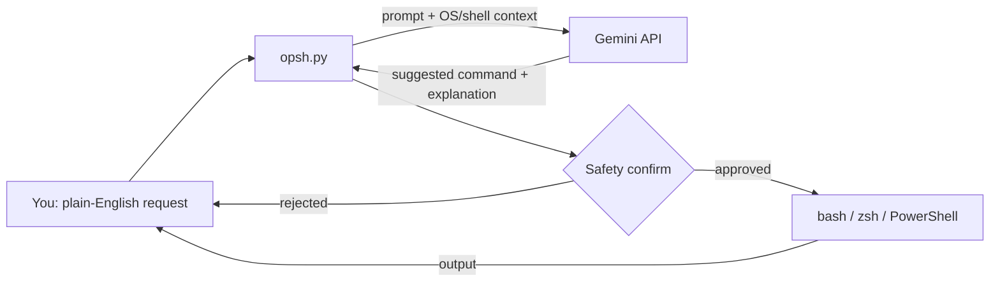

# 🚀 OpenSH

<div align="center">


[](https://opensh.vercel.app)
[](https://github.com/ai-dev-2024/OpenSH/releases)
[](LICENSE)
[](https://startup.z.ai/)
[](https://ko-fi.com/ai_dev_2024)

**[Installation](#-installation)** • **[Features](#-features)** • **[Configuration](#-configuration)**

<br>
<br>

</div>

## 🔮 Wake Up Your Terminal

**OpenSH** is the caffeine hit your command line needs. It transforms your terminal into a natural language interface that understands you.

> "Find all large video files over 1GB in my downloads folder"  
> "Convert this video to mp4 and lower the bitrate"  
> "Git commit all changes with message 'update styles'"

OpenSH translates your intent into the correct command for your OS (Windows, macOS, or Linux), explains it, and executes it.

## ✨ Features

| Feature | Description |
| :--- | :--- |
| 🗣️ **Conversational** | Speaks your language. No more `tar -xvf`. |
| ⚡ **Auto-Run** | Generates, explains, and runs commands instanty. |
| 🧠 **Smart Context** | Sees your current project structure for accurate suggestions. |
| 🔁 **Cross-Platform** | Native PowerShell for Windows, Bash/Zsh for Unix. |
| 🛡️ **Safety First** | User confirmation for destructive commands. |
| 🚀 **Zero Config** | Works out of the box. No forced subscriptions. |

## 📦 Installation

### Windows (PowerShell)
Paste this into your terminal:
```powershell
irm https://raw.githubusercontent.com/ai-dev-2024/OpenSH/main/install.ps1 | iex
```

### macOS / Linux
One-line install:
```bash
curl -fsSL https://raw.githubusercontent.com/ai-dev-2024/OpenSH/main/install.sh | bash
```

## 🎮 Usage

OpenSH launches automatically with your terminal (if configured) or by typing `opsh`.

```text
~/projects/app $ create a new react app called dashboard
🔍 Thinking...
→ npx create-react-app dashboard
```

Alternatively, use the quick command:
```powershell
ask "show my ip address"
```

## ⚙️ Configuration

OpenSH uses a `config.json` file located in `~/.opsh/`. You can edit it to change your preferred model provider (Groq or Gemini) or API keys.

```json
{
  "provider": "groq",
  "api_key": "your_key_here"
}
```

## 🤝 Contributing

We welcome contributions! Please check out the issues or submit a PR.

1. Fork the repo
2. Create your feature branch
3. Commit your changes
4. Push to the branch
5. Open a Pull Request

## 📄 License

Distributed under the MIT License. See `LICENSE` for more information.

---

<div align="center">
  <p>Made with ☕ by the AI Dev Team • © 2026</p>
</div>

## Architecture



- `opsh.py`: the whole CLI. It detects the OS and shell, sends the request with that context to the model, shows the
  proposed command with an explanation, and runs it only after you confirm.
- `install.sh` / `install.ps1` (and the matching uninstallers): put `opsh` on your PATH on macOS/Linux and Windows.
- `vercel.json`: the landing page at the homepage URL.
